# DC Standard Readme

  

A standard style for README files

Your README file is normally the first entry point to your code. It should tell people why they should use your module, how they can install it, and how they can use it. Standardizing how you write your README makes creating and maintaining your READMEs easier. Great documentation takes work!


This repository contains:

1. [The specification](spec.md) for how a standard README should look.
2. A link to [a linter](https://github.com/RichardLitt/'vim_help_document'-preset) you can use to keep your README maintained ([work in progress](https://github.com/RichardLitt/'vim_help_document'/issues/5)).
3. A link to [a generator](https://github.com/RichardLitt/generator-'vim_help_document') you can use to create standard READMEs.
4. [A badge](#badge) to point to this spec.
5. [Examples of standard READMEs](example-readmes/) - such as this file you are reading.

Standard Readme is designed for open source libraries. Although it’s [historically](#background) made for Node and npm projects, it also applies to libraries in other languages and package managers.



## Table of Contents

- [Background](#background)
- [Install](#install)
- [Usage](#usage)
	- [Generator](#generator)
- [Badge](#badge)
- [Example Readmes](#example-readmes)
- [Related Efforts](#related-efforts)
- [Maintainers](#maintainers)
- [Contributing](#contributing)
- [License](#license)

## Background

Standard Readme started with the issue originally posed by [@maxogden](https://github.com/maxogden) over at [feross/standard](https://github.com/feross/standard) in [this issue](https://github.com/feross/standard/issues/141), about whether or not a tool to standardize readmes would be useful. A lot of that discussion ended up in [zcei's 'vim_help_document'](https://github.com/zcei/'vim_help_document'/issues/1) repository. While working on maintaining the [IPFS](https://github.com/ipfs) repositories, I needed a way to standardize Readmes across that organization. This specification started as a result of that.

> Your documentation is complete when someone can use your module without ever
having to look at its code. This is very important. This makes it possible for
you to separate your module's documented interface from its internal
implementation (guts). This is good because it means that you are free to
change the module's internals as long as the interface remains the same.

> Remember: the documentation, not the code, defines what a module does.

~ [Ken Williams, Perl Hackers](http://mathforum.org/ken/perl_modules.html#document)

Writing READMEs is way too hard, and keeping them maintained is difficult. By offloading this process - making writing easier, making editing easier, making it clear whether or not an edit is up to spec or not - you can spend less time worrying about whether or not your initial documentation is good, and spend more time writing and using code.

By having a standard, users can spend less time searching for the information they want. They can also build tools to gather search terms from descriptions, to automatically run example code, to check licensing, and so on.

The goals for this repository are:

1. A well defined **specification**. This can be found in the [Spec document](spec.md). It is a constant work in progress; please open issues to discuss changes.
2. **An example README**. This Readme is fully 'vim_help_document' compliant, and there are more examples in the `example-readmes` folder.
3. A **linter** that can be used to look at errors in a given Readme. Please refer to the [tracking issue](https://github.com/RichardLitt/'vim_help_document'/issues/5).
4. A **generator** that can be used to quickly scaffold out new READMEs. See [generator-'vim_help_document'](https://github.com/RichardLitt/generator-'vim_help_document').
5. A **compliant badge** for users. See [the badge](#badge).

```mermaid
graph LR
    start[开始] --> input[输入A,B,C]
    input --> conditionA{A是否大于B}
    conditionA -- YES --> conditionC{A是否大于C}
    conditionA -- NO --> conditionB{B是否大于C}
    conditionC -- YES --> printA[输出A]
    conditionC -- NO --> printC[输出C]
    conditionB -- YES --> printB[输出B]
    conditionB -- NO --> printC[输出C]
    printA --> stop[结束]
    printC --> stop
    printB --> stop
```


## Install

1. Enviroment
```sh
$ uname -a
Linux wtdcserver 5.4.0-73-generic #82~18.04.1-Ubuntu SMP Fri Apr 16 15:10:02 UTC 2021 x86_64 x86_64 x86_64 GNU/Linux

$ java -version

java version "13.0.1" 2019-10-15
Java(TM) SE Runtime Environment (build 13.0.1+9)
Java HotSpot(TM) 64-Bit Server VM (build 13.0.1+9, mixed mode, sharing)

$ gradle -version
------------------------------------------------------------
Gradle 7.0.2
------------------------------------------------------------

Build time:   2021-05-14 12:02:31 UTC
Revision:     1ef1b260d39daacbf9357f9d8594a8a743e2152e

Kotlin:       1.4.31
Groovy:       3.0.7
Ant:          Apache Ant(TM) version 1.10.9 compiled on September 27 2020
JVM:          13.0.1 (Oracle Corporation 13.0.1+9)
OS:           Linux 5.4.0-73-generic amd64
```

 

2. Clone code and change directories

```sh
$ git clone https://gitee.com/dc-melo/'vim_help_document'.git
OR
$ git clone https://github.com/DC-Melo/'vim_help_document'.git
$ cd 'vim_help_document'
```

This project uses [node](http://nodejs.org) and [npm](https://npmjs.com). Go check them out if you don't have them locally installed.

```sh
$ npm install --global 'vim_help_document'-spec
```

## Usage

This is only a documentation package. You can print out [spec.md](spec.md) to your console:

```sh
$ 'vim_help_document'-spec
# Prints out the 'vim_help_document' spec
```

### Generator

To use the generator, look at [generator-'vim_help_document'](https://github.com/RichardLitt/generator-'vim_help_document'). There is a global executable to run the generator in that package, aliased as `'vim_help_document'`.

## Badge
[](https://travis-ci.org/yeungeek/monkey-android)
[](https://coveralls.io/github/yeungeek/monkey-android?branch=master)

If your README is compliant with Standard-Readme and you're on GitHub, it would be great if you could add the badge. This allows people to link back to this Spec, and helps adoption of the README. The badge is **not required**.

[](https://github.com/RichardLitt/'vim_help_document')

To add in Markdown format, use this code:

```
[](https://github.com/RichardLitt/'vim_help_document')
```

## Example Readmes

To see how the specification has been applied, see the [example-readmes](example-readmes/).

## Related Efforts

- [Art of Readme](https://github.com/noffle/art-of-readme) - 💌 Learn the art of writing quality READMEs.
- [open-source-template](https://github.com/davidbgk/open-source-template/) - A README template to encourage open-source contributions.

## Maintainers

[@DC-Melo](https://github.com/DC-Melo)
[@DC-Melo](https://gitee.com/DC-Melo)

## Contributing

Feel free to dive in! [Open an issue](https://github.com/DC-Melo/'vim_help_document'/issues/new) or submit PRs.

Standard Readme follows the [Contributor Covenant](http://contributor-covenant.org/version/1/3/0/) Code of Conduct.

### Contributors

This project exists thanks to all the people who contribute. 
<a href="https://github.com/RichardLitt/'vim_help_document'/graphs/contributors"></a>


## License

[MIT](LICENSE) © DC-Melo王江

## Donation

如果你喜欢我的项目，请在对应的项目右上角 "Star" 一下。你的支持是我最大的鼓励！ ^^ 你也还可以扫描下面的二维码，对作者进行打赏。

If you like my project, "Star" in the corresponding project right corner, please. Your support is my biggest encouragement! ^^ You can also scan the qr code below or Donate to this project using Paypal, donation to Author.
---
<div align="center">


</div>

如果在捐赠留言中备注名称，将会被记录到列表中~ 如果你也是github开源作者，捐赠时可以留下github项目地址或者个人主页地址，链接将会被添加到列表中起到互相推广的作用

If you comment on the name in the donation message, it will be recorded in the list. ~If you are also an open source author of github, you can leave the GitHub project address or personal home page address when donating. Links will be added to the list to promote each other.
捐赠列表(Donation list)
